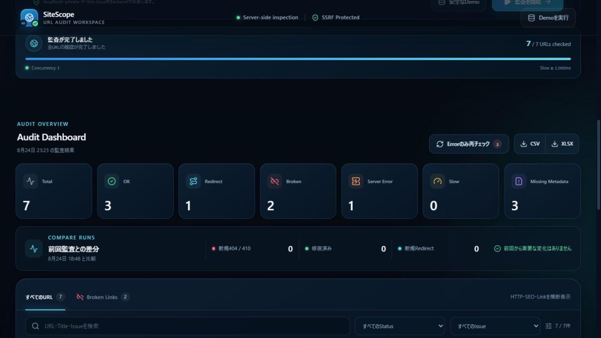
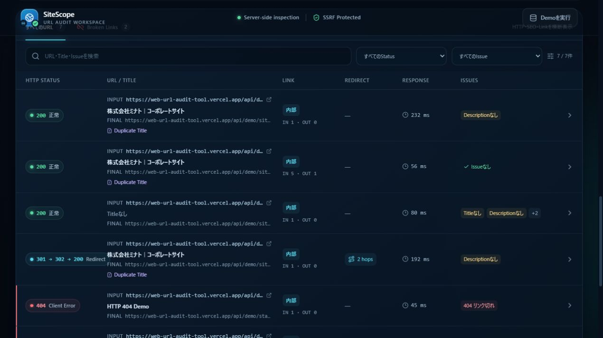
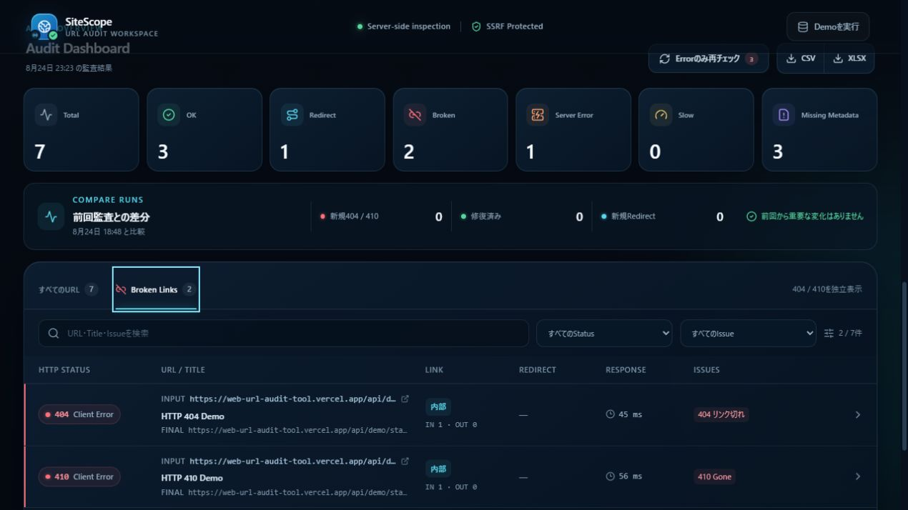
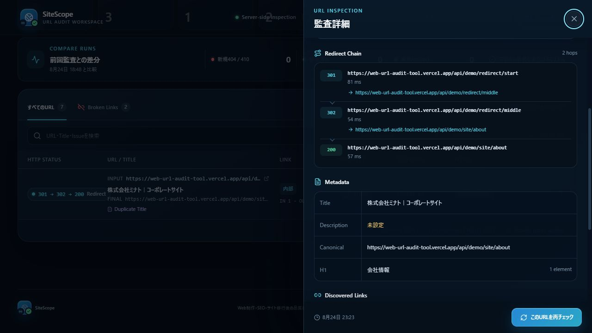
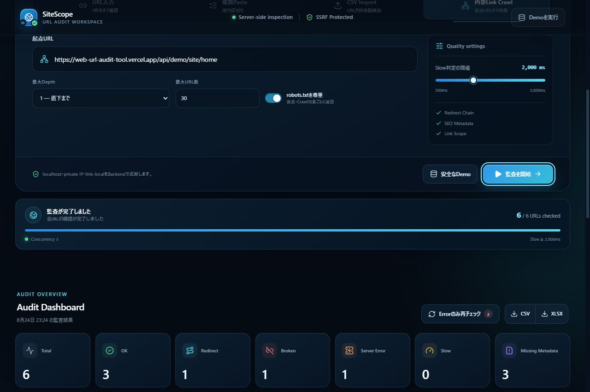

# WebサイトURL一括チェック・リンク監査ツール

URL一覧またはサイトの起点URLから、HTTP Status、Redirect、Response Time、Metadata、内部・外部Link、SEO上の基本的な欠落を一括確認するWeb業務効率化ツールです。Web制作の公開前確認、SEO点検、サイト移行後のリンク品質確認を、入力から再チェック・書き出しまで一続きで扱えます。

- 本番アプリ: [https://web-url-audit-tool.vercel.app](https://web-url-audit-tool.vercel.app)
- GitHub: [https://github.com/shunsoco-stack/web-url-audit-tool](https://github.com/shunsoco-stack/web-url-audit-tool)
- QA記録: [docs/QA.md](docs/QA.md)
- ポートフォリオ掲載用完全版プロンプト: [docs/PORTFOLIO_LISTING_PROMPT.md](docs/PORTFOLIO_LISTING_PROMPT.md)

## コンセプト

単に「URLが開くか」を確認するのではなく、Webサイト監査の実務フローを1つのWorkspaceにまとめています。

```text
URLs
↓
Crawl
↓
HTTP Check
↓
Metadata
↓
Issue Classification
↓
Filter / Search
↓
Recheck / Compare
↓
CSV / XLSX Export
```

検査RequestはBrowserから対象サイトへ直接送らず、Next.jsのNode.js Route Handlerを経由します。これによりBrowser CORSの影響を避けながら、Backend側でSSRF対策、Redirect追跡、Timeout、取得量制限を適用します。

## 主な機能

### URL入力

- URL手入力
- 改行、空白、Tab区切りの複数URL Paste
- CSV Import
  - `url`、`uri`、`link`、`href`、`website`、`ページurl`、`リンク`列を大文字小文字を区別せず検出
  - 対応Headerがない場合は、最初にURL形式と判断できる列を使用
  - quoted comma、escaped quote、CRLF、cell内改行を扱うCSV parser
- Protocolを省略した一般的なDomain形式には `https://` を補完
- 重複URLを最初の出現順で除外
- 1回の画面操作で最大100 URL

### HTTP / Redirect Check

各URLについて次を取得・表示します。

- Input URL
- HTTP Status
- Status Label
- Final URL
- Redirect Count
- Redirect Chain
- Redirect Loop / Redirect上限超過
- Response Time
- Content-Type
- Check日時

Redirectは `301`、`302`、`303`、`307`、`308` を最大8回まで追跡します。Redirect先も各HopでSSRF policyを再適用し、Loopを検出した場合は `Redirect Loop` として失敗分類します。

Response Timeは各HopでRequest開始からResponse Header受信までを計測し、Chain全体ではその合計を表示します。HTML本文の転送完了時間やBrowser rendering指標ではありません。

### Status / Broken Link分類

色だけに依存せず、数値とLabelを併記します。

| 条件 | Label / 分類 |
| --- | --- |
| 2xx | 正常 |
| Redirectを1回以上経由、または最終応答が3xx | Redirect |
| 4xx | Client Error |
| 5xx | Server Error |
| 404 | Broken Linkとして独立表示 |
| 410 | Gone / Broken Linkとして独立表示 |
| SSRF policy拒否 | 安全上ブロック |
| URL不正、Timeout、TLS・接続失敗等 | 確認失敗 |

### Metadata / SEO Quality Check

`text/html` または `application/xhtml+xml` の応答から、次を抽出します。

- Title
- Meta Description
- Canonical
- 最初のH1
- H1件数
- Anchor LinkとAnchor Text

Rule-basedで次を警告します。AIによる判定は使用していません。

- Titleなし
- Descriptionなし
- Canonicalなし
- H1なし
- Duplicate Title
- Slow Response

Duplicate Titleは、大小文字と連続空白を正規化した現在の監査結果内で判定します。

### 内部Link Crawl

- 起点URLから同一Originの内部LinkをBFSで探索
- 最大Depth: 0〜3
- 最大URL数: 5〜100、初期値30
- Client側の同時実行数: 3
- URL fragmentを除去して重複巡回を防止
- `rel="nofollow"` のLinkを探索対象から除外
- `robots.txt`尊重を既定で有効化
- 外部Linkは結果に集計するがCrawl queueへ追加しない
- 実行中に停止可能。完了済みの結果は画面に保持

無制限Crawlは行いません。探索対象は静的HTML内のAnchor Linkであり、JavaScript実行後に生成されるLinkやSitemap自動取得は対象外です。

### Dashboard / Filter / Search

Dashboardは次をリアルタイム集計します。

- Total
- OK
- Redirect
- Broken
- Server Error
- Slow
- Missing Metadata

結果一覧では次を絞り込めます。

- HTTP Status: 2xx / 3xx / 4xx / 5xx / Blocked・Failed
- Broken
- Redirect
- Slow
- Missing Title
- Missing Metadata
- Internal / External（URL一覧は先頭の有効なHTTP(S) URL、Crawlは起点URLのOriginを基準に分類）
- URL、Final URL、Title、Description、H1、IssueのKeyword検索

Broken Linksは404 / 410専用Viewで独立表示します。詳細DrawerではRedirect Chain、Metadata、内部・外部Link、Issue Codeを確認できます。

### Recheck / Compare Runs

- Error対象だけを一括再チェック
- 詳細Drawerから単一URLを再チェック
- 直前の監査Snapshotを同一Browserの `localStorage` に保存
- 前回と今回をURL単位で比較
  - 新規404 / 410
  - 修復済み
  - 新規Redirect

比較は同一端末・同一Browser Profile内の補助機能です。Account、Server Database、複数人共有、履歴一覧は実装していません。保存Snapshotは最大100 URLで、容量を抑えるため発見Link一覧を保存せず、Redirect Chainも先頭10Stepに制限します。

### CSV / XLSX Export

監査結果をBrowser内で生成しDownloadします。

- CSV
  - UTF-8 BOM付き
  - すべてのcellをquote
  - comma、quote、改行をescape
- XLSX
  - `Audit Results` sheet
  - `Issues` sheet
- Input / Final URL、Status、Redirect Chain、Response Time、Metadata、Link数、Issue、Check日時を収録
- 文字列先頭が `=`、`+`、`-`、`@` の場合にapostropheを付けるSpreadsheet Formula Injection対策

## Demo Modeは実HTTP Fixture

Demoは監査済みに見せた固定JSONや架空のResult Objectを画面へ流し込む機能ではありません。Productionと同じOriginに用意した専用Route Handlerへ、通常と同じ `/api/check` を通して実際にHTTP Requestを送り、Status、Redirect、Metadata、Response Timeを測定します。

UIの「安全なDemo」は次の7 URLを監査します。

| Fixture | 実際に確認する内容 |
| --- | --- |
| `/api/demo/site/home` | 200、Title、Description、Canonical、H1、内部・外部Link |
| `/api/demo/site/about` | 200、homeと同じTitleによるDuplicate Title、Description欠落 |
| `/api/demo/site/missing-metadata` | Title、Description、Canonical、H1の欠落 |
| `/api/demo/redirect/start` | 301 → 302 → 200のRedirect Chain |
| `/api/demo/status/404` | 実HTTP 404 |
| `/api/demo/status/410` | 実HTTP 410 |
| `/api/demo/status/500` | 実HTTP 500 |

加えて `/api/demo/redirect/loop-a` と `/api/demo/redirect/loop-b` をProduction API検証用のLoop fixtureとして用意しています。Demo Routeは `Cache-Control: no-store` と `X-Robots-Tag: noindex` を返します。

## Safety / Security Design

任意URLへ接続するBackendであるため、SSRF対策を中心にFail-closedで設計しています。

### Target policy

- `http:` / `https:` だけを許可
- URL長は最大2,048文字
- username / passwordを含むURLを拒否
- Portは80 / 443だけを許可
- `localhost`、single-label host、`.local`、`.internal`、`.lan`、`.corp`等の内部向けHostを拒否
- IPv4のloopback、private、link-local、carrier-grade NAT、documentation、benchmark、multicast、reserved等を拒否
- IPv6のloopback、unspecified、IPv4-mapped private、NAT64関連、ULA、link-local、multicast、documentation等を拒否
- Cloud metadata向けHostとlink-local rangeを拒否
- DNSで返された全Addressがpublicである場合だけ接続
- 検証済みIPへSocketを接続しつつ、HTTP Host / TLS SNIは元のHostnameを維持
- Redirectの各HopでURL parse、DNS解決、Address policyを再実行

この設計は代表的なSSRF経路を抑える防御層です。脆弱性診断、WAF、認証・課金、分散Rate Limit、全種のDNS・Network攻撃に対する保証を意味しません。

### Request / resource controls

| 項目 | 実装値 |
| --- | ---: |
| Client同時実行 | 3 Request |
| Backend全体の同時Check上限 | 6 Request |
| 同一Originの同時Check上限 | 3 Request |
| Crawl最大URL | 100 |
| Crawl最大Depth | 3 |
| DNS解決Timeout | 5秒 |
| Outbound 1 Hop Timeout | 10秒 |
| 1 URLのAudit Deadline | 24秒 |
| Vercel Function最大実行 | 30秒 |
| Redirect上限 | 8 |
| HTML Body取得上限 | 1,500,000 byte |
| Response Header上限 | 32 KiB |
| API JSON Body上限 | 16 KiB |
| API Rate bucket | 1 Client Keyあたり240 Request / 60秒 |
| API Rate bucket保持上限 | 1,000 Client Key（LRU） |
| robots.txt Body取得上限 | 128 KiB |
| robots.txt cache | 最大128 Origin / TTL 10分 |

API JSON BodyはStreamを読みながら16 KiB超過時点で中断します。Rate bucketとBackend同時Check counterはFunction instanceのmemory上にある簡易制御で、bucket自体もLRUで最大1,000 Keyに制限しています。複数Instanceで共有される永続的・分散型の制御ではありません。
240 Requestのbucketは最大100 URLの初回監査と全件再チェックを同一Window内で完了できる余裕を持たせ、実際の同時Outbound数はClient 3・Backend 6・同一Origin 3の各上限で抑えます。

Outbound Requestは `Accept-Encoding: identity` を送ります。圧縮された応答が返った場合は本文をMetadata解析せず、Status等だけを扱います。TLS certificate検証は有効です。
HTML / Anchor抽出は上限付きの単方向Scannerで行い、閉じTagがない壊れたHTMLでも入力長に対してboundedに処理します。robots wildcard判定も正規表現ではなく線形Matcherを使用し、128 KiBを超えて途中で切れたrobots本文は許可判定に使わずFail-closedで拒否します。

### robots.txt

Crawlでは既定で `robots.txt` を確認します。

- `WebAuditPortfolioBot/1.0` のUser-Agentを使用
- Bot固有GroupをWildcard Groupより優先
- 最長一致Ruleを採用し、同長ではAllowを優先
- `*` wildcardと末尾 `$` anchorに対応
- robots.txtが404なら許可
- 401 / 403 / 5xx、取得失敗、判定不能は拒否
- Redirect先を含むRequest対象ごとにrobots policyを確認
- Bodyは128 KiBまで取得
- OriginごとにTTL 10分、最大128 Originをcache

`robots.txt`尊重はCrawler etiquetteの一部であり、利用規約、著作権、アクセス許可、対象サイトの負荷条件を代替しません。監査権限のあるサイト・URLに限定して使用してください。

### App response headers

- `X-Content-Type-Options: nosniff`
- `X-Frame-Options: DENY`
- `Referrer-Policy: strict-origin-when-cross-origin`
- Camera / Microphone / Geolocationを無効化する `Permissions-Policy`
- `/api/check` は `Cache-Control: no-store`
- Next.jsの `X-Powered-By` を無効化

## Architecture

```text
Browser / React Workspace
├─ Manual / Paste / CSV input
├─ BFS Crawl queue
│  └─ concurrency 3 / depth 0–3 / max 100
├─ Progress / Dashboard / Filter / Detail
├─ localStorage snapshot comparison
└─ CSV / XLSX export
        │
        ▼ POST /api/check
Next.js Node.js Route Handler
├─ JSON validation / size limit / best-effort rate bucket
├─ URL & SSRF policy
│  ├─ scheme / credentials / port / hostname validation
│  ├─ DNS all-answer public check
│  └─ validated-address pinning per hop
├─ optional robots.txt policy
├─ HTTP(S) fetch / redirect follow / loop detection
└─ static HTML metadata & anchor extraction
        │
        ▼
Public HTTP / HTTPS target
```

Database、外部AI API、Queue、Browser extensionは使用していません。

## Tech Stack

- Next.js 16.3 / App Router / Node.js Route Handler
- React 19.2
- TypeScript 5.9
- Node.js 24
- Native `http` / `https` / `dns` APIs
- SheetJS `xlsx`
- Lucide React
- Vitest 4 / Testing Library / jsdom
- ESLint 9 / eslint-config-next
- Vercel Functions

## Getting Started

要件: Node.js 24、npm

```bash
npm install
npm run dev
```

開発Server起動後、Terminalに表示されるlocalhost URLをBrowserで開きます。

ローカル環境でDemoの自己Origin URLを `/api/check` から検査すると、SSRF policyがlocalhostを正しく拒否します。Demoの完全な実HTTP体験とProduction verifierは、public hostnameへDeployした環境で確認してください。

## Scripts

| Command | 内容 |
| --- | --- |
| `npm run dev` | Next.js開発Server |
| `npm run lint` | ESLint |
| `npm run typecheck` | Next route type生成とTypeScript型検査 |
| `npm run test` | Vitestを1回実行 |
| `npm run test:watch` | Vitest watch mode |
| `npm run build` | Production build |
| `npm run verify` | lint → typecheck → test → build |
| `npm run verify:production -- <URL>` | Deploy済み `/api/check` と実HTTP fixtureを検証 |

一括検証:

```bash
npm run verify
```

## Testing

自動Testは次を対象にしています。

- URL normalize、重複除去、Paste分割、CSV parser、Demo URL生成
- Metadata、Canonical、H1、内部・外部Link、nofollow、件数・文字数制限
- Dashboard集計、Missing Metadata、Duplicate Title、再チェック対象、前回比較
- CSV列順、Redirect Chain、quote / escape、Formula Injection対策
- IPv4 / IPv6のpublic・blocked range
- URL scheme、credentials、port、localhost、内部Suffix、DNS mixed answerの拒否
- robots.txt group、最長一致、Allow tie、wildcard、end anchor
- `/api/check` のContent-Type、JSON、Body size、入力clamp、no-store

Production verifierは次の8 caseをDeploy先で直列実行します。

1. 200 + Metadata
2. 301 → 302 → 200 Redirect Chain
3. 404 Broken Link
4. 410 Gone
5. 500 Server Error
6. Redirect Loop
7. Invalid URL
8. Private IP Block

```bash
npm run verify:production -- https://web-url-audit-tool.vercel.app
```

最終検証では8 Test file、134 / 134 TestがPassしました。Production integration verifierも8 / 8 caseがPassしています。実行記録と手動Browser QAの詳細は [docs/QA.md](docs/QA.md) を参照してください。

## Vercel Deployment

Productionは [https://web-url-audit-tool.vercel.app](https://web-url-audit-tool.vercel.app) で公開しています。検証対象Deployment IDは `dpl_JDqeoxG6iLqdDgK8jbsXJZUJp7eX` です。`vercel.json` はNext.js Frameworkと `/api/check` の30秒Function上限を指定しています。

```bash
vercel --prod
```

Production Deploy後の再検証には次を使用します。

```bash
npm run verify:production -- https://web-url-audit-tool.vercel.app
```

さらに、UIのDemo、Crawl、Broken専用View、詳細Drawer、CSV / XLSX DownloadをProduction Browserで確認します。

## GitHub公開とSecret Scan

公開Repositoryは [shunsoco-stack/web-url-audit-tool](https://github.com/shunsoco-stack/web-url-audit-tool) です。更新をPushする前に、最低限次を確認します。

```bash
npm run verify
git status --short
git diff --check
git grep -nEi "(api[_-]?key|secret|token|password|private[_-]?key)"
```

`.env*`、`.vercel/`、証明書・秘密鍵、credential JSON、log、build outputは `.gitignore` 対象です。検索語への一致だけでSecretの有無を判断せず、内容と使用箇所を手動Reviewし、利用可能な場合はGitleaks等も併用してください。

## Accessibility / Design

- Statusを色だけでなくHTTP値とLabelで表示
- Semantic landmark、table、form label、dialog role
- Keyboard focusの可視化
- 詳細DrawerのEscape終了、focus trap、終了後のfocus復帰
- SSRFでBlockしたURLをclickable linkにしない
- 44pxのcoarse-pointer操作領域
- `prefers-reduced-motion`、`prefers-reduced-transparency`、`prefers-contrast`への配慮
- System font、抑制したMotion、Translucent Materialを使うApple-inspired UI
- Desktop-firstでTablet / Smartphoneへ再配置するResponsive design

特定のWCAG適合LevelやAccessibility認証を保証するものではありません。

## Screenshots

Productionの安全なDemo Datasetを使い、次の5枚をポートフォリオ掲載用に取得済みです。

1. Audit Dashboard
   
2. URL Result Table
   
3. Broken Links
   
4. Redirect / Metadata Detail
   
5. Export / Crawl Progress
   

## Known Limitations

- 対象URLの利用規約、監査権限、法的許可を自動判定しません。権限のある対象だけに使用してください。
- JavaScriptを実行してDOMをrenderしません。Client-side rendering後だけに現れるLinkやMetadataは取得できません。
- HTML parserは安全な上限制御を持つ軽量なstatic parserで、Browser DOM parserと完全に同じerror recoveryを保証しません。
- Anchor Linkだけを探索し、Sitemap、CSS、Image、Script、Form action、headless BrowserはCrawlしません。
- Basic / Bearer / Cookie認証、Login session、custom Header、Proxy、VPN内Siteには対応しません。
- 80 / 443以外のPortは安全上拒否します。
- `Accept-Encoding: identity` に従わず圧縮応答を返すSiteではMetadata本文を解析しません。
- HTML本文は先頭1.5 MBまでを対象とします。後方にあるMetadataやLinkを取得できない場合があります。
- Response TimeはServer / Networkのその時点の値で、Core Web VitalsやPage rendering性能ではありません。
- robots.txt parserは実用上の主要Ruleに対応しますが、すべてのCrawler独自拡張を実装していません。
- Rate LimitはFunction instance内のbest-effort制御であり、分散型Abuse protectionではありません。
- Audit historyは最新Snapshotだけを同一BrowserのlocalStorageへ保存します。Server保存・共有・長期履歴はありません。
- Crawl中に発見した外部Linkは表示・集計しますが、自動検査queueには追加しません。
- XLSX生成はBrowser側でSheetJSを遅延読込するため、初回書き出しに時間がかかる場合があります。
- 実装済みの防御を超えて「SSRFを完全に防ぐ」「脆弱性診断済み」と保証するものではありません。

## Portfolio Metadata

- カテゴリ: 業務効率化ツール
- サブカテゴリ: Web監査・リンクチェック
- アプリ名: WebサイトURL一括チェック・リンク監査ツール
- 英語補助名: SiteScope — URL Audit Workspace
- Slug: `web-url-audit-tool`
- 専用アイコン: Globe + Link + Check
